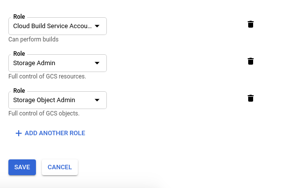
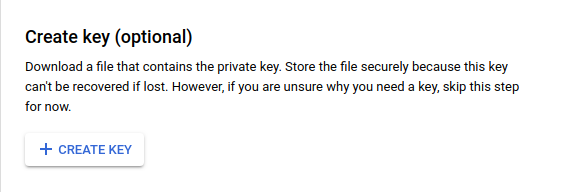

# Nginx

This container is built using Circle CI, Google Storage, and Google Cloud Build, and [hosted on Singularity Static Registry](https://singularityhub.github.io/registry-org/singularityhub/nginx/). The following standard applies:

 - each `Singularity` file corresponds to a build
 - tags are supported based on the extension of the Singularity file, with an extensionless file corresponding to "latest"

If you are interested in local usage, see [Local Usage](#local-usage).


## What can I find here?

The repository here serves the container under the namespace `singularityhub/nginx`. Specifically,
it provides an example of using CircleCI to build with Google Cloud Build and push a container to Google Storage,
and then update manifests at [singularityhub/registry-org](https://www.github.com/singularityhub/registry-org).
If you are interested in other container build templates, see [this page](https://github.com/singularityhub/registry/wiki/build-templates).

## How does this work?

We will submit this container to the (organizational) registry at 
[singularityhub/registry-org](https://www.github.com/singularityhub/registry-org)
for a final container uri corresponding to `https://singularityhub.github.io/registry-org/singularityhub/busybox`. Specifically:

```
singularityhub/registry-org  --) the organization registry
singularityhub/nginx         --) a container collection
```

then on GitHub pages:

```
singularityhub.github.io/registry-org                        --) the registry interface
singularityhub.github.io/registry-org/singularityhub/nginx   --) the added container
```

# Instructions

## 0. Fork the Repository

For the repository here to your account, and make sure to add write permissions
for a machine user for the repository, and the machine user's key to CircleCI.
This means:

 - adding the machine user as a collaborator to the repository (and accepting the invitation)
 - connecting the repository to CircleCI
 - navigating to the CircleCI project page logged in as the machine user to follow the project (button in upper right)
 - going to the settings -> Checkout SSH keys to add the machine user key.

Full instructions are provided [here](https://github.com/singularityhub/registry/wiki/deploy-container-storage#2-creating-a-connected-repository).

## 1. Setup your Organizational Registry

If you haven't done so, follow the instructions [here](https://github.com/singularityhub/registry/wiki/deploy-container-storage#organizational) to create the organizational registry. You will need to
update the environment variables in the top of the [.circleci/config.yml](.circleci/config.yml)
to reflect your repository:

```
    environment:

      # The GitHub username / reponame that the container will be submit to
      - REGISTRY_BASE: singularityhub/registry-org
...
```

You should only need to do this once. The example provided here uses 
[singularityhub/registry-org](https://www.github.com/singularityhub/registry-org).

## 2. Google Storage

We will be interacting with Google Storage via the [sregistry](https://www.github.com/singularityhub/sregistry)
command line client.

## Required environment variables

Create a Google Project and [a service account](https://cloud.google.com/sdk/docs/authorizing#authorizing_with_a_service_account).

### 1. Download the Service Account Key

You should first download a service account key from the [service accounts page](https://console.cloud.google.com/iam-admin/serviceaccounts?_ga=2.213389911.-231410963.1512057989). For the roles, add an admin for Google
Storage (to store your container), along with Storage Object Admin and Google Build Admin.



Once you add the roles, you *do not need to add users* to the account. You can next download
the service account key to your local machine, and move it to the repository folder.



Note that the .gitignore includes *.json so it won't be added to your project!

### 2. Circle CI Secrets

Once you have the `<project-id>-<number>.json` in the present working directory,
you can add the entire thing to your project as an encrypted environment variable.
Here is how to copy paste the string from your terminal:

```bash
$ cat <project-id>-<number>.json
```

Add the text output from the above to an environment variable
called `GOOGLE_APPLICATION_CREDENTIALS` along with the following (all project secrets):

 - GOOGLE_COMPUTE_ZONE: the zone you want your compute builder to run in.
 - SREGISTRY_GOOGLE_PROJECT: the id of your project, easiest to find in the Google Project console url.

Optionally, export a name for your bucket, `SREGISTRY_GOOGLE_STORAGE_BUCKET` 
(it will be created if it doesn't exist).  It will default to your project id with sregistry- as a prefix.
Don't forget to add the machine user to the repository, and then add its credential.

## Local Usage

If you want to build the container locally:

```bash
      git clone https://www.github.com/singularityhub/nginx
      cd nginx
```

First, let's talk about how we would run this image:

```bash
      sudo singularity build nginx.sif Singularity
```

You will see the image buildin, including downloading of Docker layers, installation of nginx. Now let's run it, and we start a webserver:

```bash     
./nginx.sif
Serving HTTP on 0.0.0.0 port 9999 ...
```


Welp, that was easy! 


## How does it work?
How is this working? Let's look at the spec file:


      Bootstrap: docker
      From: ubuntu:16.04

      %runscript

           cd /data
           exec python3 -m http.server 9999

      %post

           mkdir /data
           echo "<h2>Hello World!</h2>" >> /data/index.html
           apt-get update
           apt-get -y install python3     


### The Header
The First line `bootstrap` says that we are going to bootstrap a `docker` image, specifically using the (`From` field) `ubuntu:16.04`. You couldn't choose another distribution that you like, I just happen to like Debian.

### %post
Post is the section where you put commands you want to run once to create your image. This includes:

- installation of software
- creation of files or folders
- moving data, files into the container image
- analysis things

The list is pretty obvious, but what about the last one, analysis things? Yes, let's say that we had a script thing that we wanted to run just once to produce a result that would live in the container. In this case, we would have that thing run in %post, and then give some interactive access to the result via the `%runscript`. In the case that you want your image to be more like a function and run the analysis (for example, if you want your container to take input arguments, run something, and deliver a result), then this command should go in the `%runscript`.

In our case, since we are going to serve a simple web-based thing, we create a directory to work with (`/data` is easy to remember), write a terribly formatted `index.html` there (for those that aren't web focused, a web server by default will render a file called `index.html` from a root folder). We then install python, because it has a nice command for bringing up a quick web server.

### %runscript
The `%runscript` is the thing executed when we run our container. For this example, we basically change directories to data, and then use python to start up a little server on port 9999 to serve that folder. Anything in that folder will then be available to our local machine on port 9999, meaning the address `localhost:9999` or `127.0.0.1:9999`.


## Example Use Cases
If you have a folder locally with some static html files or other that you want to serve, you can map a directory to data when running the container. For example, let's map the $PWD to the container:


    singularity run -B .:/data nginx-basic.img 

The `.` is a stand in for the present working directory, I could have also done:

    singularity run -B $PWD:/data nginx-basic.img 
    singularity run -B /path/to/singularity-web/nginx-basic:/data nginx-basic.img 


Note that binding the directory at runtime WILL map your specified place to the directory (and not the file we saved there before) but it does NOT overwrite the file saved to the image. In other words, if we run the image again without binding, we see the original "Hello World!"
