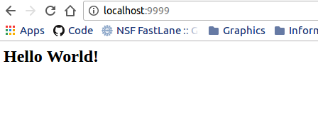

# Basic Nginx

This is an example of using a Singularity container to run a basic nginx server, and serve one or more files. Download the repo if you haven't already:

      git clone https://www.github.com/singularityhub/nginx
      cd nginx

First, let's talk about how we would run this image:

      sudo singularity create nginx.img
      sudo singularity bootstrap nginx.img Singularity

You will see the image bootstrapping, including downloading of Docker layers, installation of nginx. Now let's run it, and we start a webserver:

     
      ./nginx.img 
      Serving HTTP on 0.0.0.0 port 9999 ...

Welp, that was easy! 

## How does it work?
How is this working? Let's look at the spec file:

      Bootstrap: docker
      From: ubuntu:16.04

      %runscript

           cd /data
           exec python3 -m http.server 9999

      %post

           mkdir /data
           echo "<h2>Hello World!</h2>" >> /data/index.html
           apt-get update
           apt-get -y install python3     

### The Header
The First line `bootstrap` says that we are going to bootstrap a `docker` image, specifically using the (`From` field) `ubuntu:16.04`. You couldn't choose another distribution that you like, I just happen to like Debian.

### %post
Post is the section where you put commands you want to run once to create your image. This includes:

- installation of software
- creation of files or folders
- moving data, files into the container image
- analysis things

The list is pretty obvious, but what about the last one, analysis things? Yes, let's say that we had a script thing that we wanted to run just once to produce a result that would live in the container. In this case, we would have that thing run in %post, and then give some interactive access to the result via the `%runscript`. In the case that you want your image to be more like a function and run the analysis (for example, if you want your container to take input arguments, run something, and deliver a result), then this command should go in the `%runscript`.

In our case, since we are going to serve a simple web-based thing, we create a directory to work with (`/data` is easy to remember), write a terribly formatted `index.html` there (for those that aren't web focused, a web server by default will render a file called `index.html` from a root folder). We then install python, because it has a nice command for bringing up a quick web server.

### %runscript
The `%runscript` is the thing executed when we run our container. For this example, we basically change directories to data, and then use python to start up a little server on port 9999 to serve that folder. Anything in that folder will then be available to our local machine on port 9999, meaning the address `localhost:9999` or `127.0.0.1:9999`.

## Example Use Cases
If you have a folder locally with some static html files or other that you want to serve, you can map a directory to data when running the container. For example, let's map the $PWD to the container:

    singularity run -B .:/data nginx-basic.img 

The `.` is a stand in for the present working directory, I could have also done:

    singularity run -B $PWD:/data nginx-basic.img 
    singularity run -B /path/to/singularity-web/nginx-basic:/data nginx-basic.img 

Note that binding the directory at runtime WILL map your specified place to the directory (and not the file we saved there before) but it does NOT overwrite the file saved to the image. In other words, if we run the image again without binding, we see the original "Hello World!"
